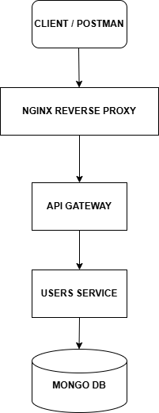
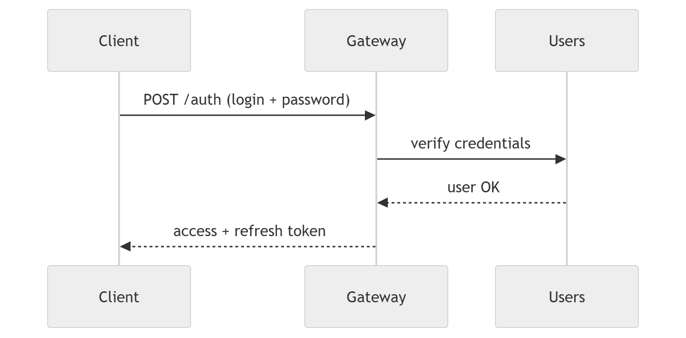

# 🚀 Auth Microservices System

[](https://www.python.org/)
[](https://fastapi.tiangolo.com/)
[](https://www.mongodb.com/)
[](https://www.docker.com/)
[](https://www.python-httpx.org/)
[](https://damiankowalczykdk.github.io/auth-microservices-system/index.html)
[](https://opensource.org/licenses/MIT)

---

## 📖 Overview

This project is a **production-style microservices system** built around a centralized **API Gateway** and a dedicated **Users Service**.

It demonstrates modern backend engineering practices such as:

* Centralized **API Gateway architecture**
* Fully **decoupled microservices**
* **JWT-based authentication** (access + refresh tokens)
* **Multi-Factor Authentication (TOTP)**
* **Role-Based Access Control (RBAC)**
* Service-to-service communication via **HTTPX**
* Independent **MongoDB-based persistence layer (Users Service)**
* Fully **async architecture (FastAPI + async IO)**
* Clean architecture separation (API / Services / Repositories)

---

## 🏗️ Architecture Overview

The system is composed of two main services:

### 🔹 API Gateway
Responsible for:
- Authentication & authorization flow
- JWT issuing & validation
- Routing requests to internal services
- Role enforcement (admin/user)
- Cookie-based refresh token handling

### 🔹 Users Service
Responsible for:
- User management (CRUD)
- Account activation flow
- Password reset system
- MFA (TOTP) setup & verification
- MongoDB persistence (Beanie ODM)

---

### 🧭 System Diagram


---

## 🔐 Authentication Flow (Credential Verification, MFA, Token Issuance)


### Authentication & Authorization

* JWT Access + Refresh Tokens
* HTTP-only cookies for refresh token storage
* Token validation via JOSE
* Role-based access control:
  - `user`
  - `admin`

### Multi-Factor Authentication (MFA)

* TOTP-based MFA (pyotp)
* QR code provisioning (base64 encoded)
* MFA verification required during login (if enabled)

### Account Security

* Email activation flow
* Password reset with time-limited tokens
* Secure password hashing via Argon2 (passlib)

---

## ⚡ Performance & Architecture Decisions

### Async-first design

* Fully asynchronous FastAPI services
* HTTPX async client for inter-service communication
* Non-blocking I/O across entire stack

### Service isolation

* API Gateway does NOT access databases directly
* Users Service owns all user-related data
* Strict separation of responsibilities

### Resilient communication

* Centralized HTTP client wrapper (`ServiceRequestClient`)
* Standardized error handling across services
* Safe request layer for upstream validation

---

## 🧱 Clean Architecture

Each service follows layered architecture:

### API Layer
- FastAPI routers
- Request validation (Pydantic schemas)
- Dependency injection

### Service Layer
- Business logic
- Authentication workflows
- MFA handling
- Token generation

### Repository Layer (Users Service)
- MongoDB access via Beanie ODM
- Query abstraction layer

---

## 💻 Tech Stack

### Backend
* Python 3.13
* FastAPI
* Pydantic v2
* Beanie ODM
* Motor (MongoDB async driver)
* HTTPX
* Passlib (Argon2)
* PyOTP (MFA)
* Python-JOSE (JWT)

### Database
* MongoDB (Users Service)

### Infrastructure
* Docker
* Docker Compose
* Nginx

---

## 🧪 Testing Strategy (Recommended Structure)

The system is designed to support:

* Unit testing (services + auth logic)
* Integration testing (API Gateway ↔ Users Service)
* Contract testing (HTTP schemas between services)

Testing tools recommended:

* pytest
* httpx.AsyncClient (API testing)


---

## 🛡️ Dev Practices & Engineering Standards

* Strict environment-based configuration (`Settings`)
* Dependency injection everywhere (FastAPI Depends)
* Centralized exception handling
* Typed schema separation (DTOs vs domain models)
* Consistent error format (`ApiException`)
* Immutable configuration (frozen settings)
* Repository pattern for persistence layer

---

## 📊 Observability & Reliability

Each service includes:

* Global error handler middleware
* Structured API error responses
* Validation error formatting
* Request-safe HTTP client wrapper
* Logging-ready architecture

---

## 🚀 Getting Started (Local Development)

### Prerequisites

* Docker & Docker Compose v2+
* Python 3.13+

---

### 1. Environment Setup
* **Copy .env.example to .env and adjust values:** 

```bash
cp .env.example .env
```
### 2. Start the Platform

* **Build and run all services:**
```bash
docker-compose up -d --build
```

* **Check logs:**
```bash
docker-compose logs -f apigateway
docker-compose logs -f users
```
### 3. Check Endpoints

- Interactive Swagger API documentation:

```text
http://localhost/docs
```

---
## 📂 Project Structure
```text
auth-microservices-system/
├── apigateway/
│   ├── apigateway/
│   │   ├── api/
│   │   ├── services/
│   │   ├── clients/
│   │   ├── core/
│   │   └── domain/
│   └── Dockerfile
├── users/
│   ├── users/
│   │   ├── api/
│   │   ├── core/
│   │   ├── domain/
│   │   ├── repositories/
│   │   └── services/
│   └── Dockerfile
├── nginx/
│   └── default.conf
├── docker-compose.yml
├── .env
└── README.md
```
---
## 🧠 Key Engineering Highlights

- Fully async microservice architecture  
- Clean separation between gateway and domain services  
- Strong typing across all layers  
- Secure authentication system (JWT + MFA)  
- Production-grade error handling strategy  
- Extensible service-to-service communication layer  

---
### 🤝 Contact

* Designed and implemented by Damian Kowalczyk.
Feel free to connect or explore other backend projects.